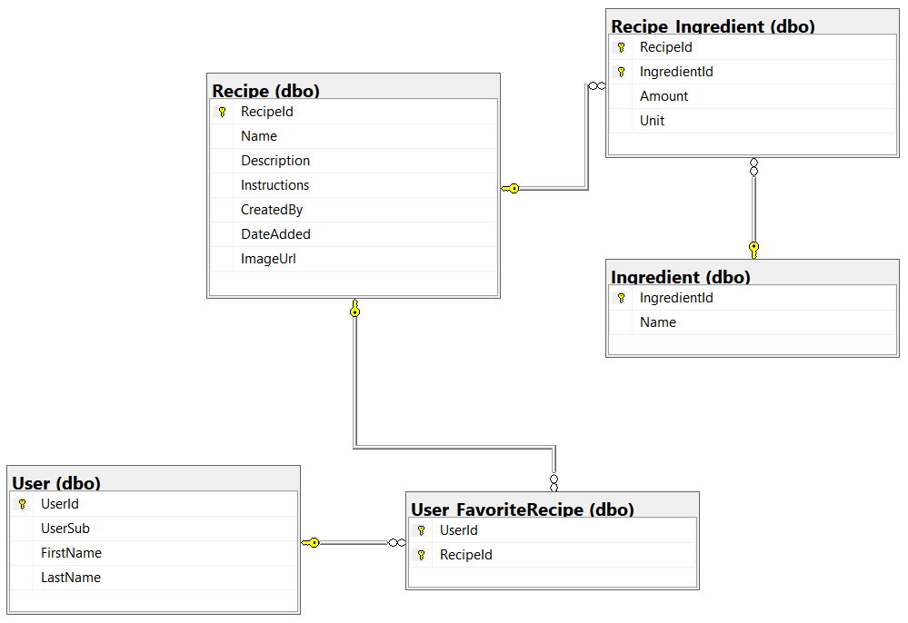

# Culinary Shares Blazor App

#### This is a project I created to practice authentication/authorization, front end design, as well as consuming APIs. I used Azure AD B2C to allow users to create an account and sign in. It also allows users to edit their profile and reset their password. If a user creates an account, they can submit a recipe for review before being permanently added to the site. Users also have the ability to favorite recipes and view recipes they have shared in one place.

#### I used Microsoft's documentation & code examples, Stack Overflow, and ChatGPT to complete the project.

## Technologies used: 
* Bootstrap 5
* Azure AD B2C
* OAuth 2.0
* OpenID Connect
* Razor Components
* Razor Syntax

## Features: 
* User account creation
* User account editing
* User password resetting
* Page-specific Authorization
* Web API consumption
* Users with accounts can share recipes
* Users with accounts can favorite recipes
* Server-Side paging for pagination components

## Database Schema

## Sample Video: 

